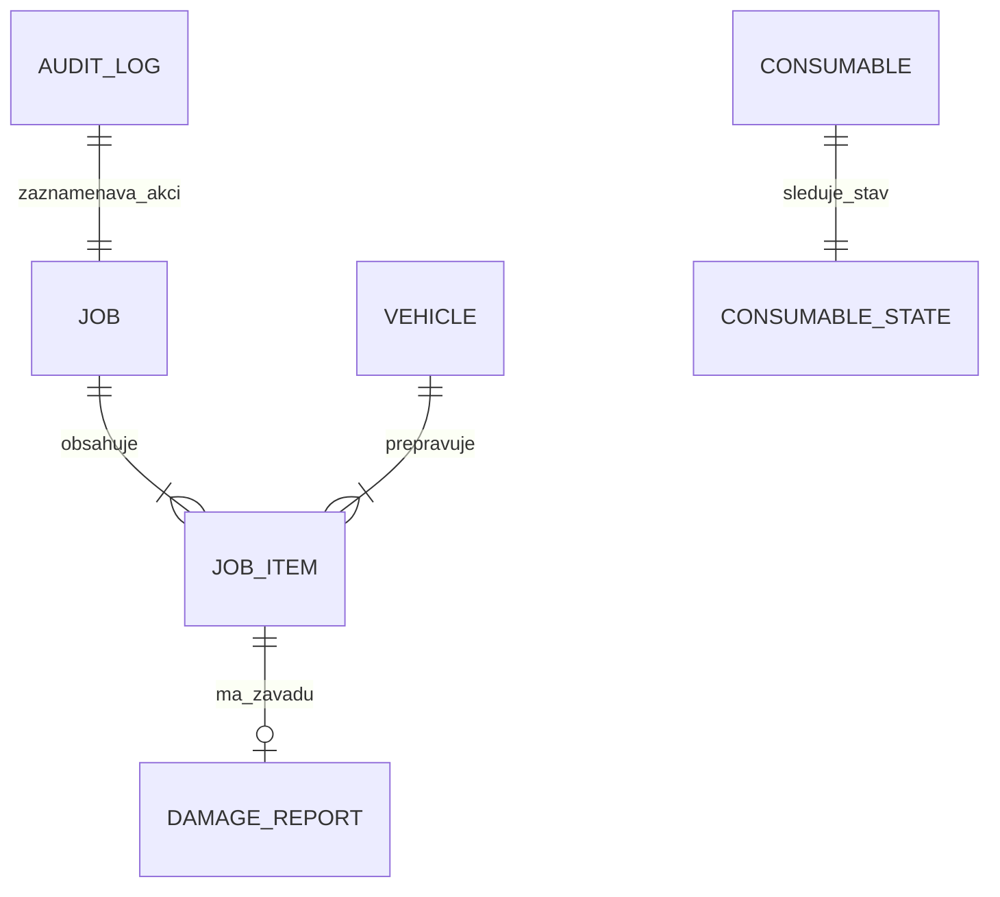

# SYSTÉMOVÁ A PROCESNÍ FUNKČNÍ SPECIFIKACE: BLP INVENTORY
**Systém logistiky filmové techniky, řízení nakládky a správy zakázek**
*Verze dokumentu: 2.0.0 (Systémová specifikace bez UI/Designu) | Datum: 21. srpna 2026*

---

## 1. Účel a Rozsah Systému

### 1.1 Účel systému
Systém **BLP INVENTORY** zajišťuje kompletní řízení životního cyklu filmové techniky (osvětlení, grip, distribuce elektřiny, kabeláže) během realizace zakázek. Systém digitalizuje proces nakládky ze skladu do transportních vozidel, její kontrolu na place při natáčení, proces zpětné sklizně techniky (**Derigging / Vracení**), správu spotřebního materiálu a ucelenou evidenci závad včetně automatizovaného generování právně závazných předávacích protokolů.

### 1.2 Uživatelé a Oprávnění
* **Lead Gaffer (Vedoucí osvětlovač):** Odpovídá za zakázku, schvaluje seznamy techniky, přiřazuje transportní vozidla a podepisuje předávací protokoly.
* **Best Boy Electric (Logistik techniky):** Řídí fyzickou nakládku a vykládku techniky, provádí průběžnou kontrolu kusů, eviduje ad-hoc položky a spravuje spotřební materiál.
* **Filmový skladník (Rental Custodian):** Přijímá nahlášené závady, vyřizuje objednávky na doplnění spotřebního materiálu a naskladňuje vrácenou techniku zpět do skladu.

---

## 2. Architektura a Datové Úložiště

* **Architektonický koncept:** Offline-First datová architektura. Veškeré operace probíhají primárně nad lokálním úložištěm zařízení (`LocalDatabaseService`) s reaktivní distribucí událostí (`InventoryRepository`).
* **Dostupnost:** Systém garantuje plnou funkčnost bez přítomnosti síťového připojení (offline v exteriérech/podzemních ateliérech).
* **Auditovatelnost:** Každá transakce nebo změna stavu je atomicky zaznamenávána do neovlivnitelného auditního logu.

---

## 3. Datový Model a Entity



### 3.1 Entity a atributy

1. **`Job` (Zakázka / Natáčecí projekt)**
   - `id`: Unikátní identifikátor zakázky (String, UUID)
   - `name`: Název natáčecí zakázky (String)
   - `client`: Klientský subjekt / produkce (String)
   - `date`: Datum realizace / natáčení (Date)
   - `assignedGaffer`: Odpovědný Gaffer (String)
   - `vehicleIds`: Seznam přiřazených vozidel (List<String>)
   - `status`: Stav zakázky (`ACTIVE`, `ARCHIVED`, `COMPLETED`)

2. **`JobItem` (Položka v zakázce)**
   - `id`: Unikátní identifikátor položky (String)
   - `jobId`: Vazba na zakázku (String)
   - `name`: Název techniky / zařízení (String)
   - `category`: Kategorie techniky (Světla, Stativy, Kábly, Distribuce, Grip)
   - `assignedVehicleId`: Identifikátor přiraženého vozidla (String)
   - `quantityRequested`: Požadovaný celkový počet kusů (Integer)
   - `quantityLoaded`: Aktuálně naložený / zpracovaný počet kusů (Integer)
   - `status`: Provozní stav (`PENDING`, `LOADED`, `PACKED`, `RESTOCKED`, `DAMAGED`)
   - `serialNumber`: Sériové číslo / Inventární kód (String, Volitelné)
   - `isAdHoc`: Příznak ad-hoc položky přidané mimo plán (Boolean)
   - `damageNotes`: Popis poruchy v případě poškození (String, Volitelné)
   - `photoUrls`: Fotodokumentace závady (List<String>)

3. **`Vehicle` (Vozidlo vozového parku)**
   - `id`: Unikátní identifikátor vozidla (String)
   - `name`: Označení auta / dodávky (String)
   - `licensePlate`: Státní poznávací značka SPZ (String)
   - `driverName`: Jméno přiřazeného řidiče (String)

4. **`Consumable` (Spotřební materiál - Kufr Brácha)**
   - `id`: Unikátní identifikátor spotřebáku (String)
   - `name`: Název materiálu (String)
   - `state`: Stav zásoby (`0` = OK / Dostatek, `1` = 50% / Upozornění, `2` = CHYBÍ / Nutno doplnit)

5. **`AuditLog` (Auditní záznam)**
   - `id`: Identifikátor záznamu (String)
   - `timestamp`: Časové razítko operace (DateTime)
   - `user`: Identifikace uživatele (String)
   - `action`: Název prováděné operace (String)
   - `detail`: Podrobný popis transakce (String)
   - `type`: Typ události (`loaded`, `damage`, `bracha`, `update`, `add`)

---

## 4. Stavový Automat a Business Pravidla

### 4.1 Stavový diagram položky (`JobItem`)

```mermaid
stateDiagram-v2
    [*] --> PENDING: Vytvoření zakázky / Přidání položky
    
    state Nakladka_Faze {
        PENDING --> LOADED: Inkrementace na 100% požadovaného množství
        LOADED --> PENDING: Dekrementace pod 100% množství
    }

    state Derigging_Faze {
        LOADED --> PACKED: Přepnutí do Deriggingu & Sbalení z placu
        PENDING --> PACKED: Přímé sbalení v režimu Derigging
        PACKED --> PENDING: Dekrementace sbalení na 0 kusů
    }

    PENDING --> DAMAGED: Nahlášení závady / poruchy
    LOADED --> DAMAGED: Nahlášení závady / poruchy
    PACKED --> DAMAGED: Nahlášení závady / poruchy

    DAMAGED --> PENDING: Zrušení závady (Undo Damage - neúplný počet)
    DAMAGED --> LOADED: Zrušení závady (Undo Damage - plný počet)

    PACKED --> RESTOCKED: Naskladnění v mezipaměti skladu
    RESTOCKED --> [*]
```

### 4.2 Business Pravidla a Korekční Logika
1. **Validace počtu kusů:** Hodnota `quantityLoaded` musí být v intervalu `<0, quantityRequested>`.
2. **Korekce stavu při snížení počtu (Decrement Rule):** Pokud je položka ve stavu `LOADED` (100 % naloženo) a uživatel sníží počet kusů o 1 nebo více, stav položky **musí okamžitě přejít zpět do stavu `PENDING`**. Položka nesmí zůstat zelená/naložená, pokud není přítomno 100 % požadovaných kusů.
3. **Režim Derigging (Vracení z placu):**
   - Při aktivním přepínači Derigging se operace přičítání interpretují jako balení techniky z placu zpět do aut (`PACKED`).
   - Sbalené položky se evidují jako připravené k odvozu a zpětnému naskladnění.
4. **Obnovení porouchané techniky (Clear Damage / Undo):**
   - Vyvolání akce `clearItemDamage` odstraní stav `DAMAGED`, vymaže textové poznámky k závadě i fotodokumentaci.
   - Pokud je `quantityLoaded == quantityRequested`, stav se automaticky obnoví na `LOADED`. Jinak přechází do stavu `PENDING`.
5. **Integrita mazání položek:** Odebrání položky ze zakázky vyžaduje explicitní potvrzení uživatelem a zápis do auditního logu s přesnou identifikací smazaného zařízení.

---

## 5. Funkční Moduly

### 5.1 Modul 01: Správa zakázek (Job Management)
* **Zakládání zakázek:** Vytvoření natáčecí zakázky s definicí klienta, termínu, odpovědného Gaffera a přiřazených vozidel.
* **Sledování průběhu:** Výpočet celkového procenta naložení zakázky dle vzorce:
  $$\text{Progress \%} = \frac{\sum \text{quantityLoaded}}{\sum \text{quantityRequested}} \times 100$$
* **Archivace zakázek:** Přesun dokončených zakázek do archivního stavu pro zabránění nechtěným editacím.

### 5.2 Modul 02: Operativní nakládka a Derigging
* **Řazení a filtrování:**
  - Filtrování položek podle vozidla (`assignedVehicleId`).
  - Vyhledávání podle klíčových slov v názvu nebo sériovém čísle (`serialNumber`).
  - Stavové filtry: *Vše*, *K naložení*, *Na place*, *K odvozu*, *Poškozeno*.
* **Identifikace techniky (QR / Barcode):**
  - Skenování QR a čárových kódů pro okamžité vyhledání a inkrementaci konkrétního sériového čísla.
* **Ad-Hoc položky:**
  - Možnost dynamického přidání nepředvídané techniky přímo na natáčení s automatickým nastavením příznaku `isAdHoc = true`.

### 5.3 Modul 03: Katalog a Předdefinované sety (Template Bundles)
* **Správa katalogu:** Členění techniky do standardních filmových kategorií (*Světla, Stativy, Kábly, Distribuce, Grip*).
* **Předdefinované balíčky (Sety):**
  - Sestavení balíčků techniky (např. *ARRI + Aputure set*, *Distribuce 63A rozvaděče*, *Astera Titan Pack*).
  - **Rozbalení setu (Expand Bundle):** Hromadné vložení všech vnořených položek setu do aktivní zakázky jedním krokem.

### 5.4 Modul 04: Servisní kufřík „Brácha“ (Consumables Management)
* **Evidence spotřebáku:** Průběžné sledování stavu spotřebního materiálu (pásky, baterie, stahovací pásky).
* **Tříúrovňové hodnocení stavu:**
  - `0` (OK): Zásoba je v pořádku.
  - `1` (50 %): Zásoba je na polovině.
  - `2` (CHYBÍ / REFILL): Materiál došel, vyžaduje doplnění ze skladu.
* **Objednávka doplnění:** Vygenerování a odeslání požadavku na doplnění deficitních položek na sklad.

### 5.5 Modul 05: Evidence a Hlášení závad (Damage Management)
* **Kategorizace poruch:**
  - *Lehké poškození (Scratch):* Kosmetická vada, zařízení je funkční.
  - *Nefunkční na place (Major):* Nefunkční zařízení, nutná náhrada ze skladu.
  - *Kritická závada (Critical):* Bezpečnostní riziko / havárie zdroje.
* **Fotodokumentace a Popis:** Příprava fotodokumentace závady a strukturované poznámky pro skladníka.

### 5.6 Modul 06: Audit Trail a Compliance (Auditní Log)
* **Nezměnitelná historie:** Záznam každé operace (změna množství, stavu, přidání vozidla, hlášení poruchy, zrušení poruchy).
* **Struktura záznamu:** Čas, identifikátor uživatele, typ operace, podrobný detail změny.

### 5.7 Modul 07: Správa vozového parku (Fleet Management) & Nastavení
* **Centrální registrace vozidel:** Evidence nákladních aut a dodávek s vazbou na SPZ a řidiče.
* **Dynaické přiřazování:** Možnost přidávat a mazat auta ve vozovém parku s okamžitým průmětem do možností nakládky.
* **Jazyková lokalizace:** Podpora češtiny (výchozí) a angličtiny.

---

## 6. Protokoly a Exporty

### 6.1 PDF Předávací Protokol Nakládky
Systém generuje tiskový PDF dokument zakázky s následující strukturou:
1. **Hlavička protokolu:** Název zakázky, klient, datum, jméno odpovědného Gaffera a přiřazená vozidla.
2. **Přehledový souhrn:** Celkový počet položek, počet naložených kusů, počet poškozených kusů, procentuální stav dokonalosti nakládky.
3. **Tabulkový seznam techniky:** Název položky, kategorie, sériové číslo (SN), požadovaný počet vs. naložený počet, výsledný provozní stav.
4. **Sekce nahlášených závad:** Detailní soupis poškozené techniky včetně závažnosti a popisu závady.
5. **Akceptační podpisový blok:** Místo pro vlastnoruční podpis Lead Gaffera a přebírajícího skladníka.

---

## 7. Nefunkční a Systémové Požadavky

1. **Spolehlivost a Offline provoz:** Veškerá data jsou uchovávána v lokální databázi. Systém nesmí ztratit rozpracovaná data při náhlém vypnutí zařízení nebo ztrátě napájení na place.
2. **Datová konzistence:** Změny stavů a počtů se provádějí transakčně.
3. **Rychlost odezvy:** Zpracování inkrementace/dekrementace položky na Giga-Stepperu musí proběhnout v čase $< 50\text{ ms}$.
