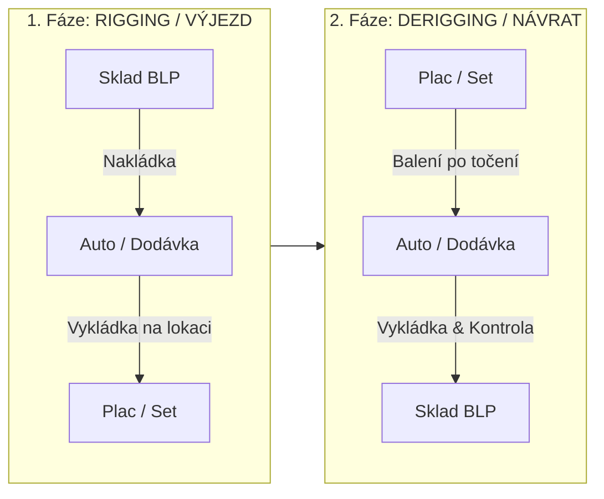

# 💡 Nový skladový systém BLP (BLP Inventory 2.0)

> Moderní, blesková a offline-first mobilní & webová aplikace pro evidenci, balení a kontrolu filmové osvětlovací techniky a spotřebního materiálu **BLP (Balloon Light Prague)**.

---

## 🔗 Rychlé odkazy

| Položka | Odkaz / Cesta |
| :--- | :--- |
| 🚀 **Živá aplikace (Web / PWA)** | [https://blp-inventory-2.vercel.app](https://blp-inventory-2.vercel.app) |
| 📖 **Testovací manuál pro partu** | [https://blp-inventory-2.vercel.app/navod.html](https://blp-inventory-2.vercel.app/navod.html) |
| 🐙 **GitHub Repozitář** | [https://github.com/PetMatejda/blp-inventory-2](https://github.com/PetMatejda/blp-inventory-2) |
| 💻 **Lokální adresář v PC** | `c:\Users\petrm\OneDrive\Dokumenty\Antigravity projects\BLP Inventory 2` |
| 🔥 **Firebase Databáze & Auth** | Google Cloud Firestore / Firebase Console (`blp-inventory`) |
| ☁️ **Vercel Deployment** | Automatický deploy z `main` větve GitHubu |

---

## 🎯 Cíl a vize projektu

Filmové natáčení je rychlé a dynamické prostředí. Cílem systému je **100% přehled o veškerém vybavení v reálném čase**, aby se předcházelo ztrátám a poškození drahé techniky:
- **Žádné ztracené položky:** Světla, balasty, sukně, difuze, stativy, kabely i rozvaděče.
- **Přehled o logistice:** Přesně víme, v jakém autě/dodávce se co veze, co už dorazilo na plac a co se vrátilo do skladu.
- **Rychlost ovládání na place:** Žádné zdržování – rychlá gesta, velká tlačítka přizpůsobená pro práci v rukavicích a ve spěchu.

---

## 🔄 Dvoufázový logistický tok (Flow zakázky)

1. **Rigging (Příprava & Výjezd na natáčení):**
   - **Sklad ➔ Auto:** Nakládka techniky podle packing listu do konkrétních vozidel.
   - **Auto ➔ Plac:** Příjezd na plac a kontrola vyloženého vybavení.
2. **Derigging (Balení & Návrat do skladu):**
   - **Plac ➔ Auto:** Zabalení a naložení techniky po skončení natáčecího dne.
   - **Auto ➔ Sklad:** Finální kontrola ve skladu a zaskladnění do regálů.

---

## ⚡ Klíčové funkce aplikace

* **👉 Swipe doprava (Gesto):** Jediným přejetím prstu po položce se okamžitě posune její logistický stav (*Naloženo / Vyloženo*).
* **⏱️ Dlouhé podržení (Long Press):** Otevře kontextové menu pro okamžité **nahlášení poškození** (vyfocení, popis závady) nebo přidání operativní poznámky.
* **➕ Operativní doplňování (Ad-Hoc / Katalog):** Když je na place potřeba světlo navíc, osvětlovač ho v Katalogu jedním klikem přiřadí k aktivní zakázce.
* **🧰 Brácha box (Spotřebák):** Evidence spotřebního materiálu (gaffy, pásky, baterky, spreje, filtry) a odepisování kusů.
* **📷 QR / Barcode skener:** Rychlé odbavování techniky přes kameru telefonu.
* **👥 Role & Oprávnění:** Všichni členové týmu mají `ADMIN` (Lead Gaffer) přístup pro plynulou práci na place.
* **🔄 Okamžitá synchronizace (Multi-device):** Firestore Realtime Listener přenáší změny mezi všemi telefony i počítačem do 100 ms.
* **📴 Offline-first spolehlivost:** Aplikace funguje i v podzemí nebo v lokacích bez signálu (lokální cache v `localStorage` se automaticky sesynchronizuje po návratu na síť).

---

## 📲 Jak nainstalovat na telefony týmu

### 🍏 iPhone / iPad (Apple iOS)
1. Otevřít odkaz [https://blp-inventory-2.vercel.app](https://blp-inventory-2.vercel.app) v prohlížeči **Safari**.
2. Dole uprostřed klepnout na tlačítko **Sdílet** (čtverec se šipkou nahoru ⎋).
3. Zvolit **„Přidat na plochu“** (*Add to Home Screen*).
4. *Výsledek:* Aplikace běží na celou obrazovku s vlastní BLP ikonou a podporou Face ID.

### 🤖 Android (Samsung, Xiaomi, Pixel...)
* **Možnost A (PWA z Chrome):** Otevřít v prohlížeči Chrome ➔ klepnout na *„Přidat na plochu / Instalovat aplikaci“*.
* **Možnost B (Nativní APK):** Přímo v aplikaci v záložce **Nastavení ⚙️** klepnout na **Stáhnout APK balíček**.

---

## 🔑 Přihlašovací údaje pro testování

* **Google Login:** Přihlášení jedním klikem přes libovolný Google účet.
* **Testovací účet BLP:**
  * **Login / E-mail:** `blp`
  * **Heslo:** `blpblp`

---

## 🛠️ Technický stack

* **Frontend:** React 18, Vite, Tailwind CSS, Lucide Icons, Canvas & HTML5 QR Scanner
* **Backend & Realtime Databáze:** Google Cloud Firestore
* **Autentizace:** Firebase Auth (Google OAuth + Email + WebAuthn Biometrie)
* **PWA & Offline:** Service Worker (`v7-final`), Web App Manifest, LocalStorage Layer
* **Hosting & CI/CD:** Vercel (napojeno na GitHub `main`)

---
*Vytvořeno pro interní potřeby BLP (Balloon Light Prague) • Srpen 2026*
